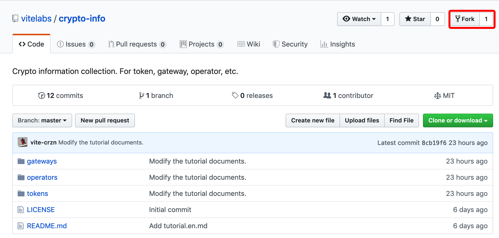
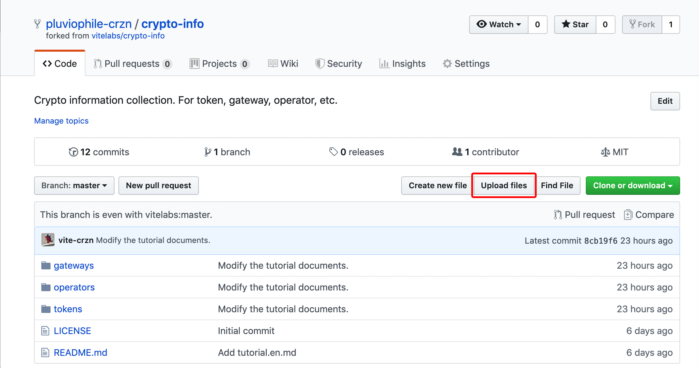
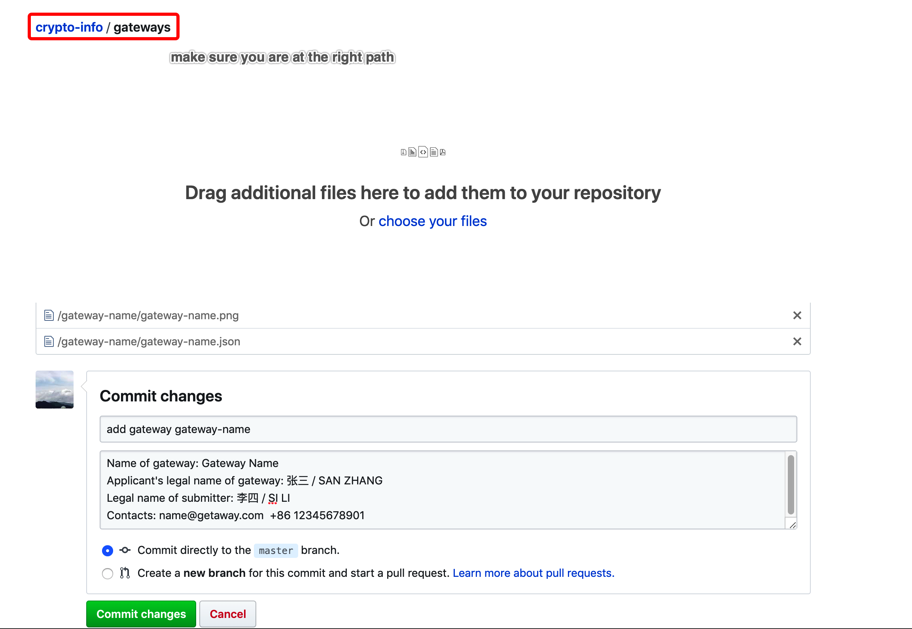
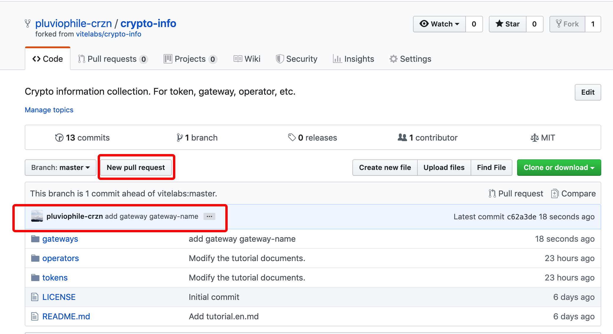
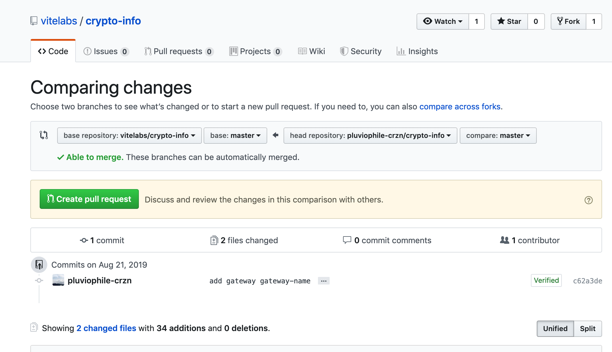
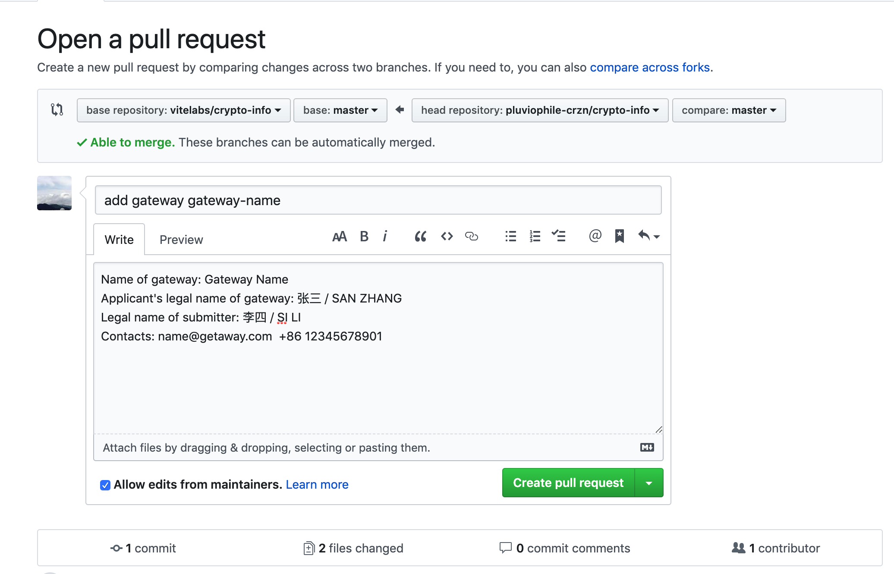
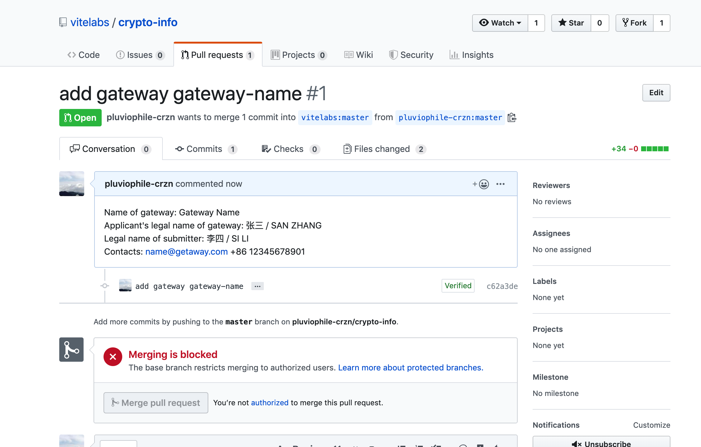

# Github Guideline

## Make sure you have all the information.

* LOGO IMAGE
* JSON FILE
>  NOTE: Please ensure to use UTF-8 encoding in the json file to avoid Travis-CI build error. Please check the template file to fill in the complete information: [token-template](./tokens/$template.json)  [gateway-template](./gateways/$template.json)  [operator-template](./operators/$template.json)

Make sure all the files were under the directory with the format-required name on your own operating system. 
  For example:

`token`
``` 
    ../btc/

    tti_b90c9baffffc9dae58d1f33f.json
    ti_b90c9baffffc9dae58d1f33f.png
```
`gateway`
``` 
    ../vite-labs/

    vite-labs.json
    vite-labs.png
```
`operator`
``` 
    ../vite_050697d3810c30816b005a03511c734c1159f50907662b046f/

    vite_050697d3810c30816b005a03511c734c1159f50907662b046f.json
    vite_050697d3810c30816b005a03511c734c1159f50907662b046f.png
```

## How to fork your own repository on GitHub and pull request. 

1. Fork the repo to your own github account.
    


2. Upload your files, make sure you are at the right path.

* Click the `Upload files` button.
    


*  Make sure you are at the right path, drag local files or directory to the designated area, attach the detailed commit information, then click the `Commit changes` button to push and update your own fork.
    

    * Token commit information: add token [token_symbol] [tti_xxx]

        * Project basic information
        * Project team background
        * Purpose of coinage
        * Contacts

    * Gateway commit information: add gateway [Gateway Name]

        * Name of gateway
        * Applicant's legal name of gateway
        * Legal name of submitter
        * Contacts

    * Operator commit information: add operator [Operator Name] [vite_xxx]

        * Operator name
        * Operator address on vite blockchain
        * Contacts


4. Pull request to `github.com/vitelabs/crypto-info`.

* Check if your commit record exists, then click the `New pull request` button.
    

* Click the `Create pull request` button.
    

* You can check and modify your commit information again.
    

* It’s already submitted successfully here, you can contact us to merge your pull request.
    
